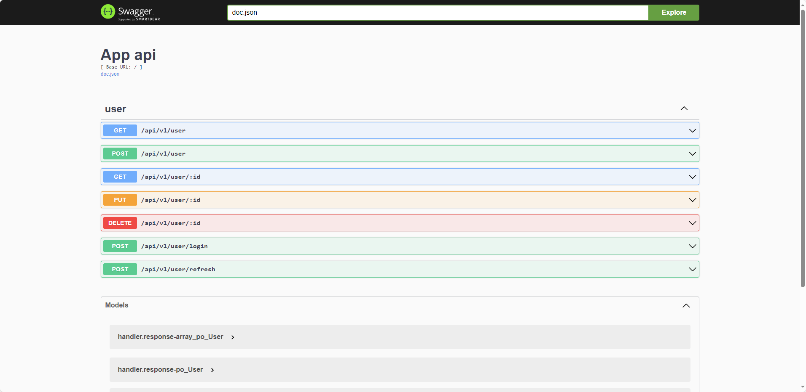

# 🐦SPARROW


> Stay away from tedious CRUD and cherish life 💖.

sparrow is library to generate out-of-box http project and provide tools to generate sql and api, which saves your life 👼.

## 💥Features

- api generation
- swagger api doc generation
- sql generation
- auto migrate
- jwt authorization
- validation
- log rotation
- dependency injection
- i18n
- prometheus & grafana

## 🚀Install

```sh
go install github.com/rickywei/sparrow/cmd/sparrow@latest
```

## 📚Tutorial

### 🏃Quick Start

#### Generate a new project by sparrow

```sh
cd dir
sparrow new yourProjectName
```

`yourProjectName` could be like `github.com/rickywei/sparrow` or `sparrow`.
Both of these two format will generate the project folder sparrow in dir(i.e. dir/sparrow).
But they have different module path in go.mod and import prefix corresponding.

Your Project will looks like following.

```txt
├── Dockerfile
├── Makefile
├── README.md
├── active.en.toml
├── active.zh.toml
├── api
│   ├── api.go
│   └── v1.go
├── app
│   ├── app.go
│   ├── wire.go
│   └── wire_gen.go
├── cache
│   └── cache.go
├── cmd
│   └── main.go
├── conf
│   └── conf.go
├── conf.yaml
├── dao
│   ├── dao.go
│   ├── gen.go
│   └── user.gen.go
├── docker-compose.yaml
├── docs
│   ├── docs.go
│   ├── swagger.json
│   └── swagger.yaml
├── go.mod
├── go.sum
├── handler
│   ├── errno.go
│   ├── handler.go
│   ├── resp.go
│   └── user.go
├── logger
│   └── logger.go
├── middleware
│   ├── auth.go
│   ├── i18n.go
│   ├── logger.go
│   └── recover.go
├── po
│   ├── sql
│   │   ├── db.sql
│   │   └── table.sql
│   └── user.gen.go
├── tool
│   ├── apigen.go
│   └── gormgen.go
├── translate.zh.toml
└── vo
    └── user.go
```

#### Start app by docker-compose

```sh
cd yourProjectName
docker-compose up
```

The app should be started and you can check api here [http://localhost:8000/swagger/index.html](http://localhost:8000/swagger/index.html)



### 💡Usage

#### Generate db operation and struct

Uncomment the todo table in ./po/sql/table.sql(also you can define your own model) then run following.

```sh
cd yourProjectName
make gorm            
# generates Todo struct in po/todo.gen.go and sql operations in dao/todo.gen.go
```

Add Todo to auto migrate.

```go
// dao/dao.go
var (
    Q  *Query
    db *gorm.DB
   
    models = []any{po.User{}, po.Todo{}} // TODO
)
```

#### Generate api

```sh
cd yourProjectName
make api name=todo   
# generates TodoHandler in handler/todo.go
# generates Todo in vo/todo.go. You should modify this to adapt your handler, reference vo/user.go
```

Then you should add the handler to api and routes like userHandler.

```go
// api/api.go
type API struct {
    engine *gin.Engine
    srv    *http.Server
    ctx    context.Context
    cancel context.CancelFunc
   
    userHandler *handler.UserHandler
    todo *handler.todoHandler // TODO
}

func NewApi(userHandler *handler.UserHandler, todo *handler.TodoHandler/*TODO*/) *API {
 // ...
    api := &API{
     engine: engine,
     srv:    srv,
     ctx:    ctx,
     cancel: cancel,
   
     userHandler: userHandler,
     todoHandler: todoHandler, // TODO
 }
}

// api/v1.go
func init() {
    routes = append(routes, func(api *API) {
        v1 := api.engine.Group("api").Group("v1")
        {
            v1.POST("user", api.userHandler.Create)
            // ...
        }
        // TODO
        {
            v1.POST("todo", api.todoHandler.Create)
            // ...
        }
    })
}

// handler/handler.go
// ...
var (
    ProviderSet = wire.NewSet(NewUserHandler, NewTodoHandler/*TODO*/)
)

```

You need to register handler in api and define your routes. (this part may be automatic in the feature)

#### generate swagger doc

```sh
cd yourProjectName
make swag
```

#### dependency inject

```sh
cd yourProjectName
make wire
```

`make wrie` will handle the dependency of each handler with api and do DI for you in app/wire_gen.go

## 🎯TODO

- [ ] keep previous code when generating vo and handler rather than override
- [ ] modify api and routes automatically after api generation
- [ ] support prometheus and grafna
- [ ] i18n example
- [ ] zh README.md

## 🤝 Contributing

- Fork the [project](https://github.com/rickywei/sparrow)
- Fix [open issues](https://github.com/rickywei/sparrow/issues) or request new features

## 🦸Contributors


## 👏Show your support

Give a ⭐️ if this project helped you!

## 📝 License

This project is [MIT](./LICENSE) licensed.

Copyright (c) 2023 [RickyWei](https://github.com/rickywei)
